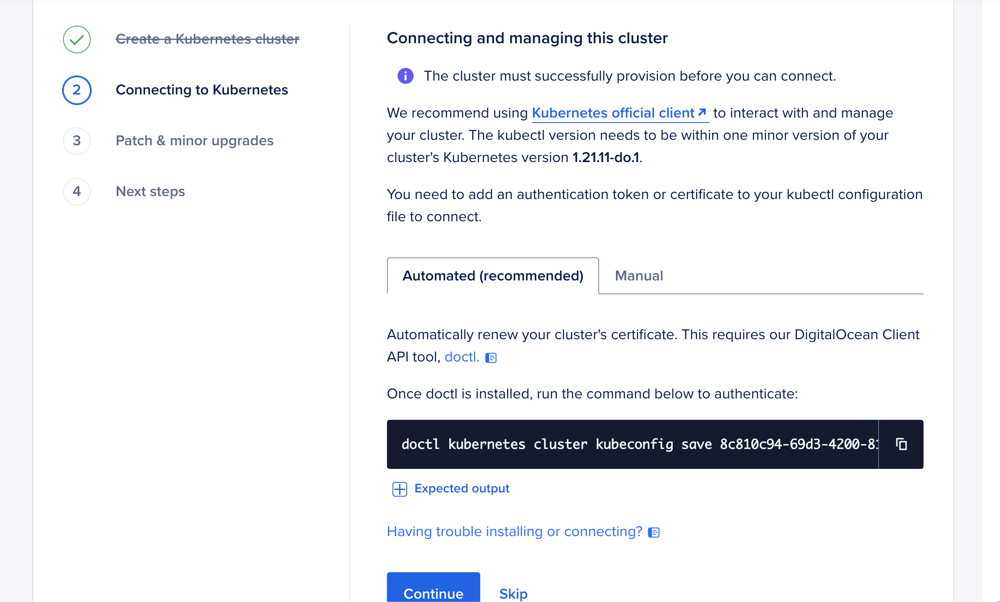

# Chapter 1 - Create a DigitalOcean Kubernetes Cluster with Terraform

## Rationale 
In order to setup a GitOps workflow, you need to use an Infrastructure as Code (IaC) tool so you can define  infrastructure in files that can be tracked by a source control tool like Git. 

[Terraform](https://www.terraform.io/) is software that uses declarative configuration files to automate the provisioning of infrastructure resources like compute instances, managed databases, firewalls and Kubernetes Clusters. 

In this chapter we will use Terraform to create a DigitalOcean Managed Kubernetes Cluster with a control plane and three nodes, like the diagram below. 


Diagram Source: [Kubernetes Components
Documentation](https://kubernetes.io/docs/concepts/overview/components/)

## Prerequisites
- [A DigitalOcean Account](https://cloud.digitalocean.com/registrations/new)
- [doctl](https://docs.digitalocean.com/reference/doctl/how-to/install/)
- [Terraform](https://learn.hashicorp.com/tutorials/terraform/install-cli#install-terraform) 
- [kubectl](https://kubernetes.io/docs/tasks/tools/)

## Instructions 
### Step 1 - Clone and change into the workshop repository 
 
Go to Github and fork clone the [KubeCon EU 2022 Workshop Repo](https://github.com/digitalocean/kubecon-2022-doks-workshop/) and then change into the directory. 

**Note** Make sure to update the command with your github username.

To clone with SSH: 
```sh
git clone git@github.com:<GITHUB_USERNAME>/kubecon-2022-doks-workshop.git
cd kubecon-2022-doks-workshop
```

To clone with HTTPS: 
```
git clone https://github.com/<GITHUB_USERNAME>/kubecon-2022-doks-workshop.git
cd kubecon-2022-doks-workshop
```

### Step 2 - Configure `doctl` 
1. [Create an API token](https://cloud.digitalocean.com/account/api/)
2. Export your token as an environment variable called `DO_TOKEN`.
```sh
export DO_TOKEN="<YOUR_DO_TOKEN>"
```

**Note:** Since Windows doesn't support enviornment variables, Windows users should keep the token on their clipboard to easily paste.

3. [Use the API token to grant account access to doctl](https://docs.digitalocean.com/reference/doctl/how-to/install/#step-3-use-the-api-token-to-grant-account-access-to-doctl)
```sh
doctl auth init 
```
4. [Validate that doctl is working](https://docs.digitalocean.com/reference/doctl/how-to/install/#step-4-validate-that-doctl-is-working)
```sh
doctl account get
```

You should see output like this: 

```sh
Email                            Droplet Limit    Email Verified    UUID                                    Status
kschlesinger@digitalocean.com    25               true              4ba4b281-ie98-4888-a843-2365cf961232    active
```

### Step 4 -  Update the [doks.tf](./terraform/doks.tf) file

Look for the comments and check the following: 

- Change the datacenter region to one that is geographically close to you 
- Ensure you have the slug for latest version of DigitalOcean Kubernetes 

### Step 5 -  Initialize your Terraform working directory

Change into the Terraform directory and run the initialize command: 

```sh
cd terraform 
terraform init
``` 

If successful, you will see this message: 

```sh
Terraform has been successfully initialized!

You may now begin working with Terraform. Try running "terraform plan" to see
any changes that are required for your infrastructure. All Terraform commands
should now work.

If you ever set or change modules or backend configuration for Terraform,
rerun this command to reinitialize your working directory. If you forget, other
commands will detect it and remind you to do so if necessary.
```

### Step 6 - Run Terraform Plan and Apply 

Run `terraform plan` 
```sh
terraform plan -var do_token=$DO_TOKEN 
```
If the plan looks good, run `terraform apply`.

```sh
terraform apply -var do_token=$DO_TOKEN
```
You must respond with `yes` to this prompt in order to create a cluster. You will see this question:

```sh
Do you want to perform these actions?
Terraform will perform the actions described above.
Only 'yes' will be accepted to approve.
``` 

```sh 
Enter a value: yes
```
If the apply is successful, it will take a 4-5 minutes for your cluster to provision. 

To see the status of your cluster, go to the [DigitalOcean Cloud Console](https://cloud.digitalocean.com/) and click on the Kubernetes Tab. You will see a progress bar indicating whether or not your cluster is fully provisioned. When your cluster is ready, Terraform will also send you a success message in the terminal. 

```sh
Apply complete! Resources: 1 added, 0 changed, 0 destroyed.
```

### Step 7 - Add an authentication token or certificate to your `kubectl` configuration file to connect

Once your cluster is ready, download a kubeconfig file with your authentication data. 

From the Kubernetes view in the Cloud Console, click on the `Overview` tab and go to `2. Connecting to Kubernetes`. There, you will find a `doctl` command that will download all the necessary info to your kubeconfig file. 



For more in-depth instructions, please see the official DigitalOcean documentation on [how to connect to a cluster](https://docs.digitalocean.com/products/kubernetes/how-to/connect-to-cluster/). 

### Step 8 -  Verify your cluster is up and running and that you can connect

When your cluster is ready, run the command 

```sh
kubectl get nodes
``` 

You should see output similar to this: 

```sh
NAME                   STATUS   ROLES    AGE    VERSION
kubecon-node-cbu76     Ready    <none>   1m     v1.22.8
kubecon-node-cbu7a     Ready    <none>   1m     v1.22.8
kubecon-node-cbu7e     Ready    <none>   1m     v1.22.8
``` 

Congratulations! You have created a Kubernetes Cluster with Terraform.

### Learn More
- [Hashicorp Learn: Terraform](https://learn.hashicorp.com/terraform)
- [DigitalOcean Terraform Provider](https://registry.terraform.io/providers/digitalocean/digitalocean/latest/docs/resources/kubernetes_cluster)